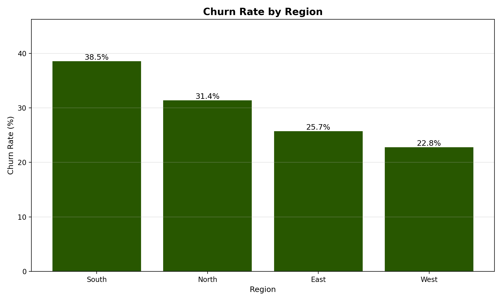
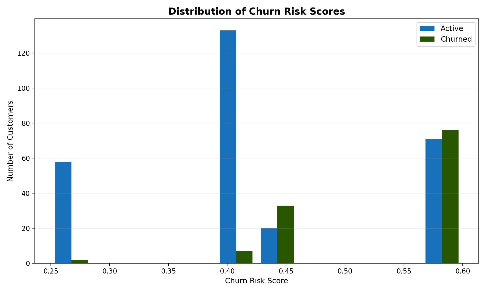

# Customer Behavior & Churn Risk Analysis

---

## 1. Project Overview
This is an end-to-end data analysis project designed to identify customers at risk of leaving (churning) and to understand the behavioral patterns of active users.

Instead of only running ad-hoc analysis inside a notebook, this project was built as a **modular analytics pipeline**. It mirrors a real-world workflow where raw data is ingested into a database, analyzed using SQL and Python, and transformed into actionable risk scores and visual insights.

**Relevance:**  
This project demonstrates skills relevant to **Data Analyst** and **Business Intelligence** roles, with a focus on ETL, SQL querying, feature creation, and business-driven logic.

---

## 2. Key Questions Answered
The analysis focuses on answering the following business questions:

- What differentiates active customers from churned ones?  
  *(Spending behavior and transaction frequency)*

- Which regions have the highest churn rates?

- Who is at risk?  
  *(Each customer is assigned a churn risk score to help prioritize retention efforts)*

- How does customer tenure relate to churn?  
  *(Do newer customers leave faster than long-term customers?)*

---

## 3. Tools & Technologies

- **Python**  
  Core analysis logic, data manipulation (Pandas), and visualization (Matplotlib)

- **SQL (SQLite)**  
  Used for structured data storage and initial aggregations directly in the database

- **Pandas**  
  Table joins, missing value handling, and customer-level metric creation

- **Modular Code Structure**  
  The project is split into multiple scripts (`db_setup.py`, `sql_analysis.py`, etc.) instead of a single large file, improving readability and maintainability

---

## 4. Dataset Description
The project uses a **synthetic dataset** that represents a subscription or transaction-based business. It consists of two main tables:

- **Customers**
  - `customer_id`
  - `signup_date`
  - `region`
  - `is_active` (churn flag)

- **Transactions**
  - Individual transaction records linked by `customer_id`

> **Note:** Since the dataset is synthetic, the focus of this project is on the **analysis logic and pipeline structure**, rather than on specific real-world numerical trends.

---

## 5. Project Workflow
The project is executed through a single entry point (`main.py`), which orchestrates the following steps:

1. **Database Setup**  
   `db_setup.py` creates a local SQLite database and loads raw CSV data into relational tables.

2. **SQL Analysis**  
   `sql_analysis.py` runs SQL queries to compute high-level metrics (e.g., churn rate by region) directly in the database.

3. **Feature Engineering**  
   `create_features.py` aggregates transaction-level data into customer-level metrics such as:
   - Total spending  
   - Transaction count  
   - Customer tenure (days)

4. **Risk Modeling**  
   `churn_model.py` applies business rules to calculate a churn risk score between **0.0 and 1.0**.

5. **Visualization**  
   `visualization.py` generates charts and saves them to an `outputs/` directory.

---

## 6. Churn Risk Approach
For this project, a **rule-based heuristic model** was used instead of a complex “black-box” machine learning algorithm.

**Why this approach?**  
In many internship and entry-level business settings, interpretability is more valuable than model complexity. The goal is to clearly explain *why* a customer is considered high risk.

The risk score is inspired by **RFM-style logic** (Recency, Frequency, Monetary):

- **Low Frequency:** Fewer than 3 transactions → +0.4 risk  
- **Low Spend:** Below median total spending → +0.3 risk  
- **Short Tenure:** Customer tenure under 100 days → +0.2 risk  

This produces a transparent score that can be easily understood and used by non-technical stakeholders.

---

## 7. Key Insights

- **Transaction frequency matters most:**  
  Customers with low transaction counts show the highest churn risk.

- **Regional differences exist:**  
  Certain regions exhibit significantly higher churn rates, suggesting possible localized issues or competitive pressure.

- **Spending correlates with retention:**  
  High-spending customers tend to be more loyal, while churned customers show noticeably lower lifetime value.

---

## 8. Limitations

- **Synthetic Data:**  
  The dataset is simulated and may not fully capture real-world noise or edge cases.

- **Static Snapshot:**  
  The analysis evaluates churn risk at a single point in time rather than tracking changes over time.

- **Heuristic Weighting:**  
  Risk weights (e.g., +0.4 for low frequency) are assumption-based. In a production setting, statistical models would be used to optimize these values.

---

## 9. Potential Improvements
If extended further, this project could be improved by:

- **Predictive Modeling**  
  Training a Logistic Regression or Random Forest model to estimate churn probability more rigorously.

- **Interactive Dashboards**  
  Connecting the SQLite database to Tableau or Power BI for dynamic exploration.

- **Automated Reporting**  
  Generating a weekly report or alert system that flags high-risk customers for retention teams.

---

## 10. Visual Results
Below are example visualizations generated by the analysis:

### Churn & Customer Behavior Visuals

