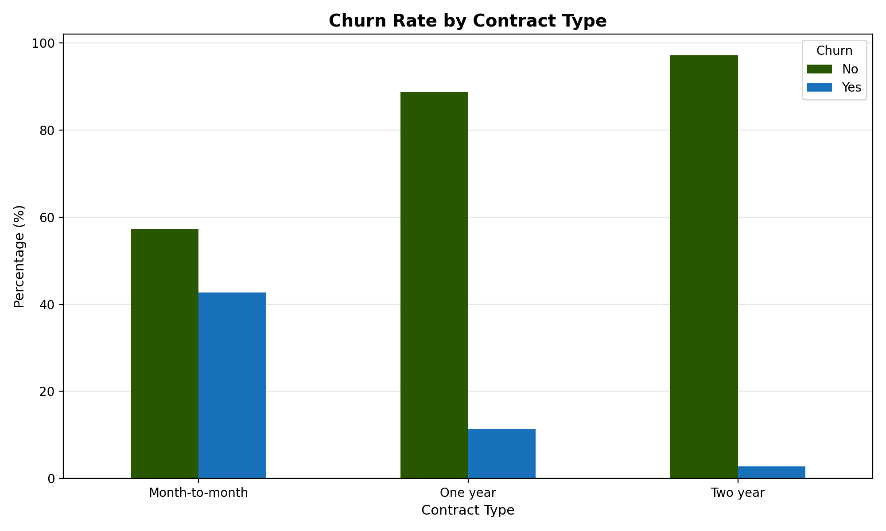
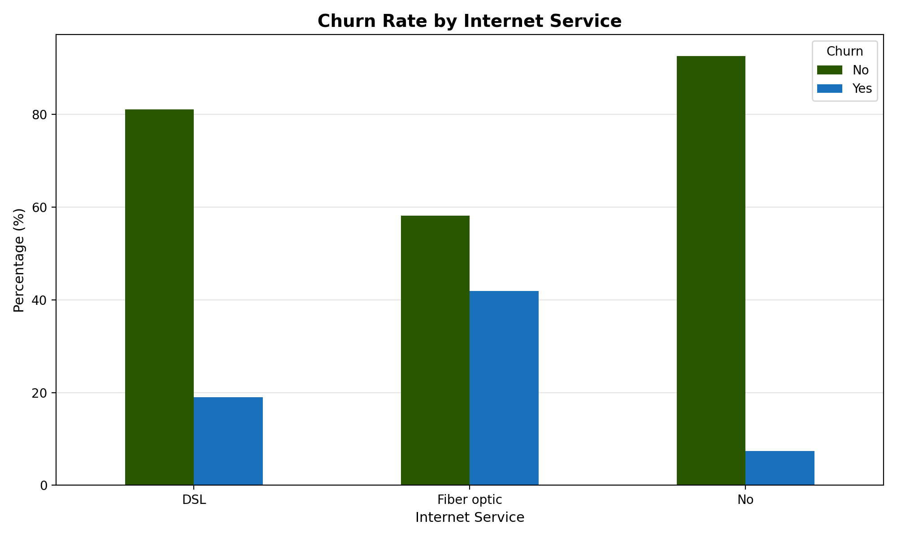
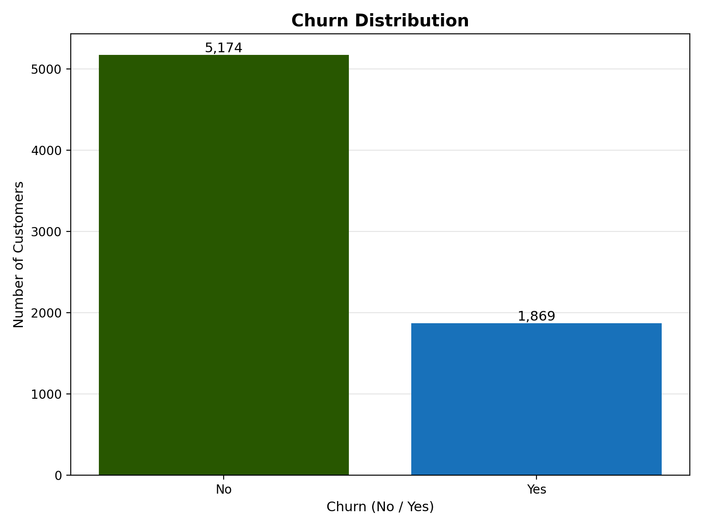
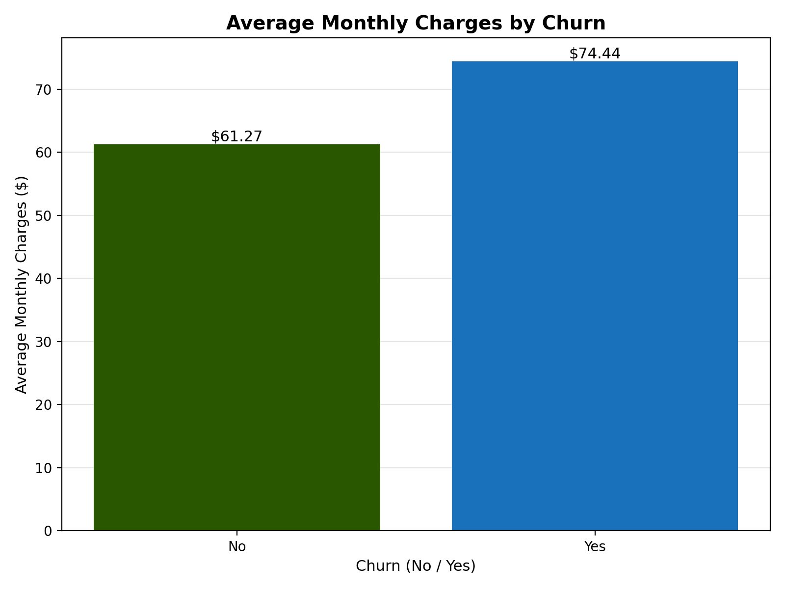
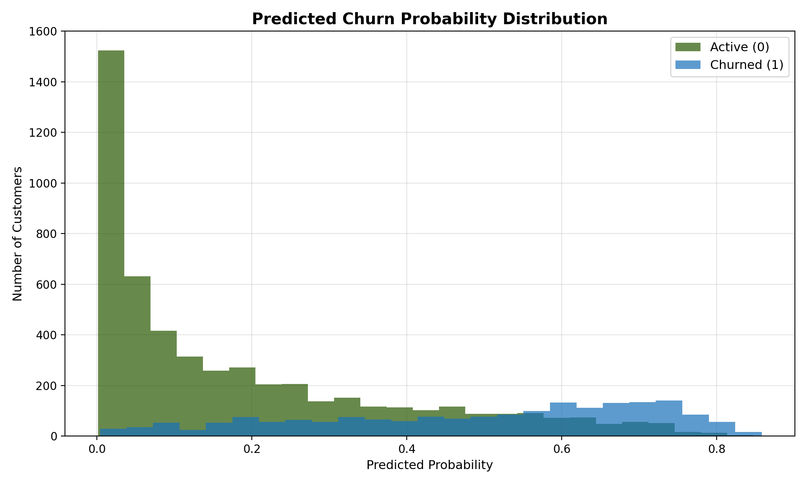

# Customer Behavior & Churn Risk Analysis

An end-to-end data analytics pipeline for predicting customer churn on the Telco dataset. Built to demonstrate a real-world analytics workflow — from raw CSV to a SQLite database, SQL-driven KPIs, feature engineering, a trained logistic regression model, and publication-quality visualizations.

---

## Business Problem

Customer churn is one of the most costly problems in subscription-based businesses. Identifying *which* customers are likely to leave — and *why* — allows retention teams to intervene before it happens.

This project answers four core business questions:

- What is the overall churn rate, and how does it vary by contract type and internet service?
- Do churned customers pay more or less per month than active ones?
- Which customer attributes are most predictive of churn?
- Can we assign each customer a probability score to prioritize retention efforts?

---

## Dataset

The project uses the [Telco Customer Churn dataset](https://www.kaggle.com/datasets/blastchar/telco-customer-churn?resource=download), a widely-used benchmark dataset for churn modelling.

| Field | Description |
|-------|-------------|
| `customerID` | Unique customer identifier |
| `gender`, `SeniorCitizen`, `Partner`, `Dependents` | Demographics |
| `tenure` | Months the customer has been with the company |
| `PhoneService`, `MultipleLines`, `InternetService` | Service subscriptions |
| `OnlineSecurity`, `TechSupport`, `StreamingTV`, etc. | Add-on services |
| `Contract` | Month-to-month, one year, or two year |
| `MonthlyCharges`, `TotalCharges` | Billing information |
| `Churn` | Target variable — Yes / No |

21 columns are selected from the raw CSV; `TotalCharges` is coerced to numeric (blank strings exist for `tenure = 0` customers).

---

## Pipeline Overview

The project runs as a single command (`python main.py`) that orchestrates six sequential steps:

```
main.py
 ├── [1] db_setup.py        -> Load CSV into SQLite
 ├── [2] sql_analysis.py    -> Run KPI queries
 ├── [3] data_loader.py     -> Pull table into pandas
 ├── [4] create_features.py -> Feature engineering
 ├── [5] churn_model.py     -> Train & evaluate model
 └── [6] visualization.py   -> Generate & save charts
```

---

## Project Structure

```
Customer-Behavior-Analysis/
├── data/
│   └── telco-customer-churn.csv
├── database/
│   └── churn.db
├── notebooks/
│   └── customer_churn_analysis.ipynb
├── outputs/                           # charts saved here
├── src/
│   ├── churn_model.py
│   ├── create_features.py
│   ├── data_loader.py
│   ├── db_setup.py
│   ├── sql_analysis.py
│   └── visualization.py
├── .gitignore
├── LICENSE
├── main.py
└── README.md
```

---

## Step-by-Step Breakdown

### 1. Database Setup — `db_setup.py`

Loads the raw CSV into a local SQLite database. SQLite is used to mirror how data is typically stored in production analytics environments and to enable SQL querying in the next step.

- Selects 21 relevant columns (intentional schema design)
- Coerces `TotalCharges` blanks to `0.0` for `tenure = 0` customers
- Writes to a `customers` table with `if_exists='replace'` for idempotency

### 2. SQL Analysis — `sql_analysis.py`

Answers four business questions using pure SQL via `pd.read_sql_query`:

| Query | Insight |
|-------|---------|
| Overall churn rate | ~26% of customers churned |
| Churn by contract type | Month-to-month: ~43% \| Two-year: ~3% |
| Churn by internet service | Fibre optic: ~42% \| DSL: ~19% |
| Average charges by churn | Churned: ~$74/mo \| Active: ~$61/mo |

### 3. Data Loading — `data_loader.py`

Pulls the full `customers` table from SQLite into a pandas DataFrame. All downstream steps work from this single source of truth.

### 4. Feature Engineering — `create_features.py`

Transforms raw data into a numeric feature matrix suitable for sklearn:

- Encodes the target: `Churn` Yes/No -> 1/0
- Drops `customerID` (key, not a predictor)
- One-hot encodes all categorical columns via `pd.get_dummies(drop_first=True)`
- Casts the entire matrix to `float64`

This produces ~30 binary and numeric features from the original 21 columns.

### 5. Churn Risk Model — `churn_model.py`

Trains a **Logistic Regression** classifier to output a calibrated churn probability for each customer.

**Why Logistic Regression?**
- Outputs probabilities directly (important for risk scoring)
- Fast to train and easy to interpret
- Strong baseline before exploring ensemble methods

**Key implementation details:**
- `solver='liblinear'` — avoids numpy matmul overflow on older builds
- `stratify=y` in `train_test_split` — preserves class ratio in train/test sets
- `StandardScaler` applied before fitting

**Evaluation metrics:**

```
ROC-AUC:  ~0.86

              precision    recall  f1-score
    Active        0.85      0.91      0.88
   Churned        0.69      0.56      0.62
```

The model clearly separates churned from active customers, with an ROC-AUC of ~0.86 indicating strong discriminative ability.

### 6. Visualization — `visualization.py`

Generates five charts saved to `outputs/`:

| File | Description |
|------|-------------|
| `churn_distribution.png` | Raw counts of active vs. churned customers |
| `churn_by_contract.png` | Churn rate (%) by contract type |
| `churn_by_internet.png` | Churn rate (%) by internet service |
| `monthly_charges_vs_churn.png` | Average monthly charges by churn status |
| `probability_distribution.png` | Predicted churn probability — active vs. churned overlay |

All charts use a consistent colour palette: **dark green `#285700`** for active customers, **blue `#1871BA`** for churned.

---

## Outputs

<table>
  <tr>
    <td></td>
    <td></td>
  </tr>
  <tr>
    <td></td>
    <td></td>
  </tr>
  <tr>
    <td colspan="2" align="center">
      
    </td>
  </tr>
</table>

---

## Key Insights

- **Contract type is the strongest retention lever.** Month-to-month customers churn at ~43% vs. ~3% for two-year contracts. Nudging customers toward longer contracts would have an outsized impact on retention.
- **Fibre optic customers churn at twice the rate of DSL customers (~42% vs. ~19%)**, despite paying more per month — suggesting a service quality or expectation mismatch worth investigating.
- **Churned customers pay ~$13/month more on average.** Higher bills without corresponding perceived value appear to drive attrition.
- **The model assigns high probabilities (>0.6) almost exclusively to actual churners**, making it actionable for prioritising retention outreach.

---

## Technologies Used

| Tool | Purpose |
|------|---------|
| Python 3.9+ | Core language |
| pandas | Data manipulation and SQL result handling |
| NumPy | Numerical operations |
| scikit-learn | Model training, scaling, and evaluation |
| matplotlib | Visualizations |
| SQLite / sqlite3 | Lightweight relational database |
| Jupyter Notebook | Interactive exploration |

---

## How to Run Locally

**1. Clone the repository and navigate to the project folder:**
```bash
git clone <repo-url>
cd Customer-Behavior-Analysis
```

**2. Install dependencies:**
```bash
pip3 install pandas scikit-learn matplotlib notebook ipykernel --break-system-packages
```

**3. Place the dataset:**

Download `telco-customer-churn.csv` from [Kaggle](https://www.kaggle.com/datasets/blastchar/telco-customer-churn) and place it in the `data/` folder.

**4. Run the full pipeline:**
```bash
python main.py
```

Charts will be saved to `outputs/` and the database to `database/churn.db`.

**5. Or explore interactively:**
```bash
jupyter notebook notebooks/customer_churn_analysis.ipynb
```

---

## Business Value

This pipeline translates raw customer data into a prioritised list of at-risk customers with interpretable risk scores. A retention team could directly consume the output of `churn_model.py` to:

- Flag customers with a predicted churn probability > 0.5 for proactive outreach
- Segment high-risk customers by contract type or service tier to tailor interventions
- Track churn rate trends over time by re-running the pipeline on updated data exports

---

## Future Improvements

- **Ensemble models** — Random Forest or XGBoost would likely improve recall on the churned class, which is currently the weaker side of the model.
- **SHAP explainability** — Adding SHAP values would make feature contributions visible per customer, strengthening the interpretability story for non-technical stakeholders.
- **Interactive dashboard** — Connecting the SQLite output to Tableau or a Streamlit app would enable self-serve exploration by business teams.
- **Automated retraining** — Scheduling the pipeline to run on fresh data exports and flag model drift over time.
